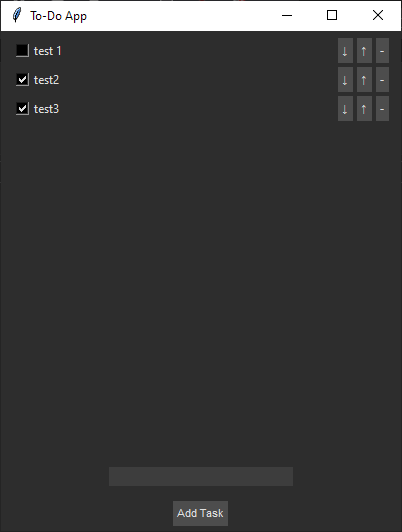
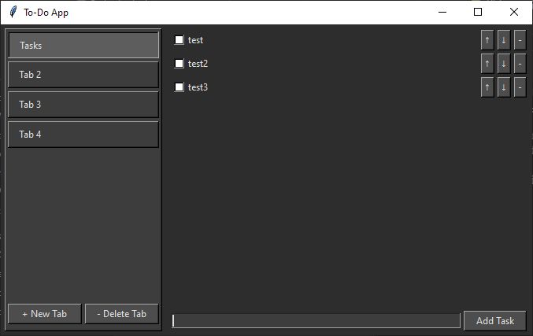

 Python To-Do Applications

This repository contains two versions of a Tkinter-based to-do list application:

## 1. Simple To-Do List

- Basic task management (add/delete/check)
- Dark mode interface
- Task persistence
- No dependencies beyond Python+Tkinter

**Run it:** `python simple_todo/todo.py`

## 2. Tabbed To-Do List 

- All features from simple version
- Tabbed organization
- Renameable tabs
- Tab-specific task lists

**Run it:** `python tabbed_todo/main.py`

## Structure
- **simple_todo/** - Basic version
  - `todo.py`
- **tabbed_todo/** - Advanced version
  - `main.py`
   - `controllers/`
     - `task_controller.py` 
     - `tab_controller.py`
   - `models/`
     - `data_manager.py`
   - `views/`
     - `main_window.py`
     - `tab_view.py`
     - `task_view.py`
- **screenshots/**
- `LICENSE.md`
