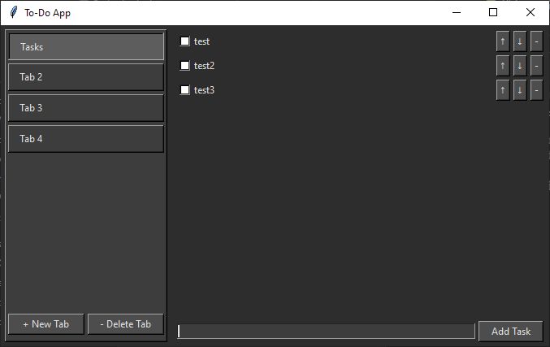

# Tabbed Todo List Application



A todo list application with tab support, built with Python and Tkinter. Organize your tasks across multiple tabs with checkboxes and persistent storage.

## Features

- **Tabbed Interface**:
  - Create, rename, and delete  todo tabs
  - Intuitive right-click context menu for tab management
  - Persists between sessions

- **Task Management**:
  - Add, complete (check), and delete tasks
  - Reorder tasks with up/down buttons
  - Checkbox toggles for task completion

- **User Experience**:
  - Dark mode interface
  - Remembers window size and position
  - Keyboard shortcuts (Enter to add tasks)

- **Data Persistence**:
  - Automatically saves all data to `todo_data.json`
  - No setup required - just run and use

## Installation

1. **Prerequisites**:
   - Python 3.8+
   - Tkinter (usually included with Python)

2. **Run the application**:
   ```bash
   git clone https://github.com/yourusername/todo_app_with_tabs.git
   cd todo_app_with_tabs
   python main.py